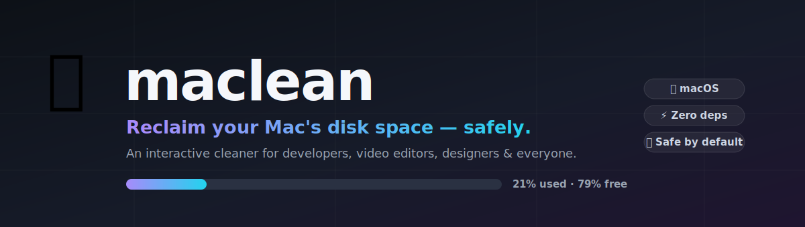

<div align="center">



# 🧹 maclean

**Reclaim your Mac's disk space — safely.**

An interactive, safe-by-default disk analyzer & cleaner for macOS.
Built for *everyone*: developers, video editors, designers, musicians,
photographers — or just someone whose MacBook is full.

[](#)
[](LICENSE)
[](#)
[](#)
[](CONTRIBUTING.md)

</div>

---

> Your 256 GB MacBook Air says *"Disk Almost Full"* and you have no idea why.
> `maclean` finds the gigabytes hiding in caches, build artifacts, simulators,
> and app data — then helps you clean them up **without touching your real work.**

## ✨ Why maclean?

Every Mac slowly fills up with invisible junk: Next.js build caches, `node_modules`,
Xcode simulators, browser caches, failed model downloads, old installers…
maclean scans for **exactly those things**, shows you what's safe to delete, and
asks before touching anything.

- 🔒 **Safe by default** — personal data (projects, photos, libraries) is only ever
  *reported*, never auto-deleted. Only regenerable caches & build output are offered
  for cleaning.
- 👤 **Knows who you are** — pick a profile (Developer, Video Editor, Designer, …) and
  maclean scans the things *relevant to you*.
- 🪶 **Zero dependencies** — a single Bash script. No Homebrew package, no Node,
  no Python. Works on a fresh Mac.
- 🍎 **Native macOS** — understands APFS volumes, `~/Library`, Xcode, iOS simulators.
- ⚡ **Fast** — pure shell + `du`/`find`. No spinning beachball.
- 🧪 **Dry-run mode** — preview everything before a single byte is deleted.

## 📦 Installation

**One line** (recommended):

```bash
curl -fsSL https://raw.githubusercontent.com/mdshahincoder/maclean/main/install.sh | bash
```

Then open a new terminal (or `source ~/.zshrc`) and run:

```bash
maclean
```

<details>
<summary><b>Manual install</b></summary>

```bash
git clone https://github.com/mdshahincoder/maclean.git
cd maclean
chmod +x maclean
./install.sh        # copies to ~/bin and wires up your PATH
```

Or copy the single file yourself:

```bash
curl -fsSL https://raw.githubusercontent.com/mdshahincoder/maclean/main/maclean -o ~/bin/maclean
chmod +x ~/bin/maclean
```

Make sure `~/bin` is on your `PATH` (`export PATH="$HOME/bin:$PATH"` in your `~/.zshrc`).

</details>

<details>
<summary><b>Update</b></summary>

```bash
maclean update          # if installed via git
# or re-run the install one-liner to get the latest release
```

</details>

## 🚀 Quick start

```bash
maclean                 # 👈 guided scan — asks who you are, scans smartly
```

```
   ╭───────────────────────────╮
   │  🧹 maclean  v1.0.0        │
   │  Reclaim your disk space  │
   ╰───────────────────────────╯

First, what best describes you?

  1) 📚  Everyone / Student (general cleanup)
  2) 💻  Developer / Software Engineer
  3) 🎬  Video Editor
  4) 🎨  Designer / Illustrator
  5) 🎵  Musician / Producer
  6) 📸  Photographer
  7) 🚀  Power User (scan everything)

  Pick a number (1-7): 2
```

maclean then prints a tailored report — items marked **✅ safe to clean** and
**⚠️ review manually** — and offers to clean the safe ones for you.

## 👤 Profiles

maclean adapts its scan to what you do. Set yours once:

```bash
maclean setup developer      # or: video | designer | music | photo | everyone | power
```

| Profile | What maclean looks for |
|---------|------------------------|
| 📚 **Everyone** | Trash, browser caches, `~/Library/Caches`, large Downloads, iPhone backups |
| 💻 **Developer** | `node_modules`, `.next`/`build`/`dist`, Xcode DerivedData, iOS simulators, npm/pnpm/Yarn/Homebrew/CocoaPods caches, Docker data |
| 🎬 **Video Editor** | Adobe Media Cache, DaVinci Resolve data, Final Cut libraries, large video files |
| 🎨 **Designer** | Adobe cache, Figma cache, Sketch data |
| 🎵 **Musician** | Logic Pro / Ableton caches, Spotify cache, Logic/GarageBand projects |
| 📸 **Photographer** | Photos library size, Lightroom cache & catalogs |
| 🚀 **Power User** | All of the above |

> **The key idea:** ✅ items are *regenerable* (safe to delete, apps rebuild them).
> ⚠️ items are *your data* — maclean shows them so you know they're big, but
> never deletes them for you.

## 📖 Commands

```bash
maclean                # guided scan (the friendly entry point)
maclean scan           # same as above
maclean setup [profile]# choose / change your profile
maclean overview       # disk status + biggest home folders
maclean big            # biggest individual files (>100MB)
maclean dev            # dev build artifacts (node_modules, .next, …)
maclean nodes          # project node_modules (safe to delete)
maclean caches         # known cache locations
maclean clean <target> # targeted clean: nodes | caches | dev | trash | brew
maclean doctor         # environment & dependency check
maclean update         # update to the latest version
maclean --help         # full usage
maclean --version
```

### Flags

```
-n, --dry-run    preview only — never delete anything
-y, --yes        skip confirmation prompts
--no-color       disable colored output
```

### Examples

```bash
maclean scan --dry-run          # preview what a full scan would clean
maclean clean nodes             # delete project node_modules (safe)
maclean clean dev               # delete build output (.next, build, dist, …)
maclean clean caches            # clear ~/Library/Caches
maclean clean trash             # empty the Trash
maclean clean brew              # brew cleanup --prune=all
maclean big                     # hunt down the biggest files on disk
```

## 🧠 How it works

maclean is a single ~600-line Bash script. It uses only standard macOS tools
(`find`, `du`, `df`, `awk`, `stat`) so it runs anywhere with zero setup.

**Scanning** is a curated set of known storage hogs. For each, maclean measures
the size and classifies it:

- **✅ Safe** — regenerable caches & build output (e.g. `node_modules`, `.next`,
  DerivedData). Deleting these breaks nothing; a rebuild or `npm install` brings
  them back.
- **⚠️ Review** — personal data (projects, photos, video libraries, downloads).
  Shown for awareness; never auto-deleted.

**Cleaning** only runs after an explicit confirmation, and every action is
preview-able with `--dry-run`.

### The node_modules safety filter

`maclean nodes` only targets **project** `node_modules`. It deliberately skips
node_modules that live inside hidden/system dirs — like `~/.nvm`, `~/.vscode`,
`~/Library/Application Support/Zed`, Discord, etc. Deleting those would break
Node, npm, and editor extensions. *(See the `NODE_SAFE_FILTER` in the source.)*

## 🛡️ Safety

- ❌ **Never** deletes your source code, projects, photos, videos, or documents.
- ✅ Only touches things that regenerate (caches, build output, Trash).
- 🔔 Every destructive action shows a summary and asks for confirmation.
- 👀 `--dry-run` lets you preview exactly what would happen, risk-free.
- 🧾 Personal data is reported with a ⚠️ badge so you can clean it manually if you choose.

> Still nervous? Run `maclean scan --dry-run` first. Nothing is deleted until you say yes.

## 🆚 How does it compare?

| | maclean | OmniDiskSweeper | `brew cleanup` | CleanMyMac |
|---|:--:|:--:|:--:|:--:|
| Free & open source | ✅ | ✅ | ✅ | ❌ ($\) |
| One command, no GUI | ✅ | ❌ | ✅ | ❌ |
| Knows your workflow (dev/video/…) | ✅ | ❌ | ❌ | ❌ |
| Safe-by-default auto-clean | ✅ | ❌ (manual) | ⚠️ brew only | ✅ |
| Dry-run preview | ✅ | ❌ | ✅ | ❌ |

## 🤝 Contributing

Contributions are welcome and appreciated! 💜

- 🐛 [Report a bug](https://github.com/mdshahincoder/maclean/issues/new?template=bug_report.md)
- 💡 [Suggest a feature](https://github.com/mdshahincoder/maclean/issues/new?template=feature_request.md)
- 🔧 Open a pull request — see [CONTRIBUTING.md](CONTRIBUTING.md)

Great first issues: add scan profiles for new apps (Blender, Notion, Slack, …),
improve path detection, add translations, or write tests. maclean is one file, so
it's easy to grok.

### 📦 Versioning

This project uses [**Changesets**](https://github.com/changesets/changesets) for
versioning and changelog management. When you open a PR that changes user-facing
behavior, add a changeset:

```bash
npm run changeset        # answer the prompts, commit the generated file
```

When your PR is merged to `main`, a bot automatically opens a **“Version Packages”**
PR with the version bump and changelog already prepared — merging it cuts a release.
See [VERSIONING.md](VERSIONING.md) for details.

## ⭐ Show your support

If maclean freed up space on your Mac, give it a **star** ⭐ at the top of the
[repo](https://github.com/mdshahincoder/maclean) — it helps others find it and keeps
the project going.

## ❓ FAQ

**Is it safe?** Yes. maclean only deletes regenerable data and asks before every
action. Use `--dry-run` to preview. Your code and files are never touched.

**Do I need Homebrew / Node / Python?** No. maclean is pure Bash and ships as one
file. It *integrates* with Homebrew/pnpm/npm if you have them (for `clean brew`,
`pnpm store prune`, etc.), but none are required.

**Where does it store its config?** `~/.config/maclean/` (just your profile choice).

**Will it delete my Chrome profiles / Logic projects / Photos?** No. Those are all
classified as ⚠️ *review* items. maclean shows their size but never deletes them.

**Does it work on Linux?** It's built for macOS. Some commands (`overview`, `big`)
work, but the curated cache paths are macOS-specific.

## 📄 License

[MIT](LICENSE) © Shahin Alam

---

<div align="center">

Made with 🧹 for full MacBooks everywhere.

[Report a bug](https://github.com/mdshahincoder/maclean/issues) ·
[Request a feature](https://github.com/mdshahincoder/maclean/issues) ·
[⭐ Star the repo](https://github.com/mdshahincoder/maclean)

</div>
